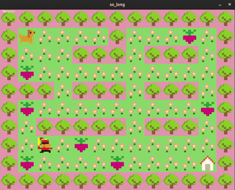

## so_long

A simple 2D game built with MiniLibX as part of the 42 School curriculum.
The player navigates a map, collects all collectibles, and reaches the exit while avoiding enemies.

## Features📌

2D graphics rendered using MiniLibX.

Custom map parser: validates walls, collectibles, player, and exit.

Path validation: ensures the map is solvable.

Collectibles system: player must collect all before exiting.

Enemy movement (bonus): player loses if caught.

Animations for player/enemy (bonus).

Move counter displayed on screen.

## Usage💻
```
make
```
```
./so_long <mapfile>
```

## Key Action🎮

W / ↑	Move up

A / ←	Move left

S / ↓	Move down

D / →	Move right

ESC	Exit game


